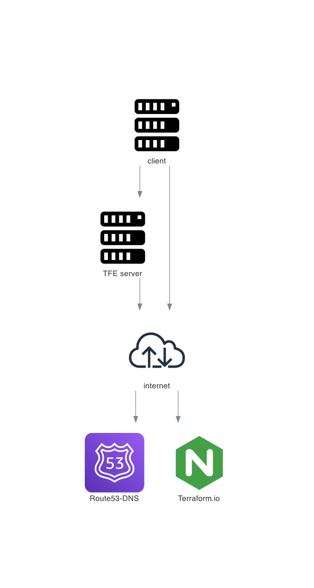

# TFE_demo_valid_certificate

You will install a TFE latest version with valid certificates on a vagrant machine. 

The valid certificates will be created with let's encrypt  
The DNS record will be created at Amazon route53

# Diagram
The TFE server installation will connect to the internet to download and install necessary files. 

When the user wants to connect to TFE it will connect to the internet and route53 tp translate the DNS name to an ip address. Then it will connect to the TFE server which has a valid certificate for the DNS name and show a secure webpage. 

# Done
- [x] Vagrant box
- [x] Generate valid TLS certificates with Let's encrypt
- [x] Create Valid DNS record
- [x] Create terraform settings.json file
- [x] Create replicated.conf file
- [x] tfe installation script
- [x] First user automation

# To do  
