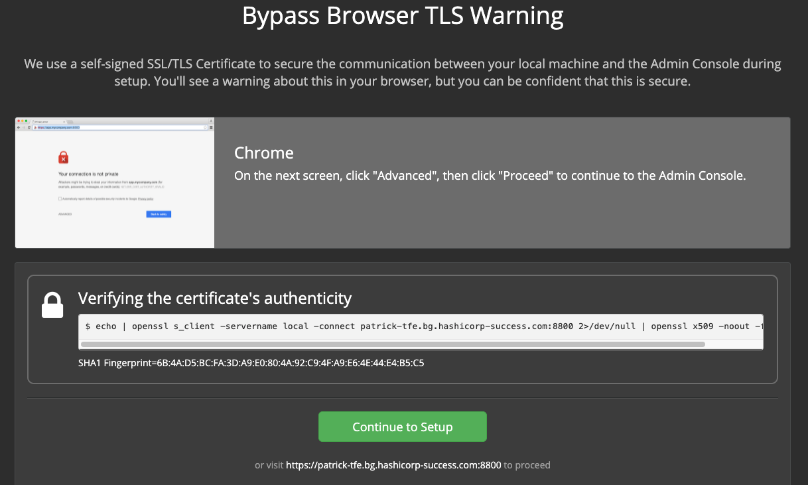
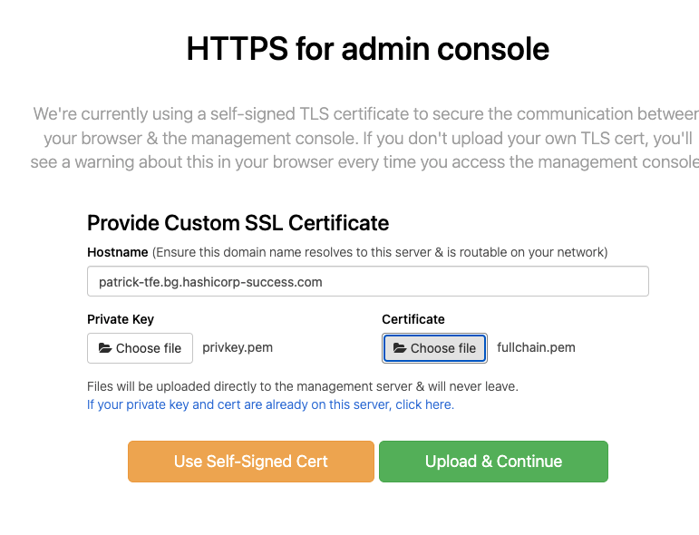
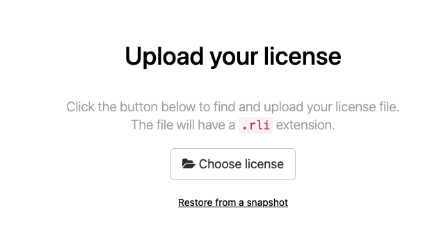
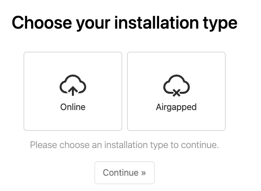
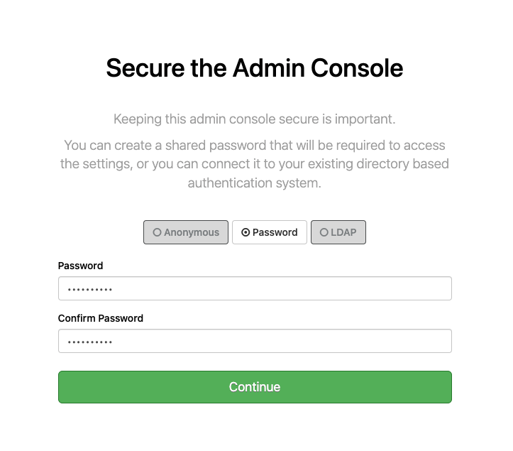
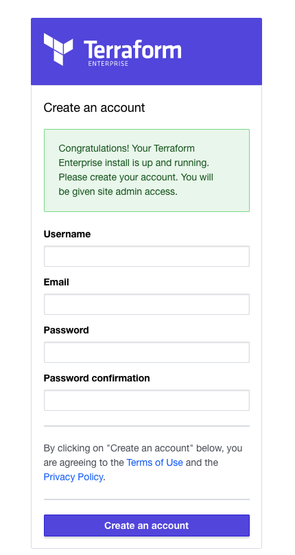

# manual installation TFE demo with valid certificates

This manual describes how to manually install TFE (Terraform Enterprise) with valid certificates

For the official documentation [see this link](https://www.terraform.io/enterprise/install/interactive/installer)

Steps involved:
- Start an ubuntu machine with Vagrant in Virtualbox
- Install TFE
- Configure TFE basics

# Prerequisites

## Vagrant
Vagrant [See documentation](https://www.vagrantup.com/docs/installation)  
Virtualbox [See documentation](https://www.virtualbox.org/wiki/Downloads)

## License
Make sure you have TFE license available for use

## Valid certificates
- Make sure you have valid certificates and store these under ```certificates/```
- a dns record pointing to ```192.168.56.33```

See manual [Create certificates](../create_certificate/README.md)

# How to

- Start the Vagrant box on which we we will install TFE
```
vagrant up
```
- login to the Vagrant box
```
vagrant ssh
```
- Download and run the installation script
```
curl https://install.terraform.io/ptfe/stable | sudo bash
```
- For the private ip address choose ```1```
```
Determining local address
The installer was unable to automatically detect the private IP address of this machine.
Please choose one of the following network interfaces:
[0] enp0s3	10.0.2.15
[1] enp0s8	192.168.56.33
Enter desired number (0-1): 1
```
- service IP address can be blank
```
Determining service address
The installer was unable to automatically detect the service IP address of this machine.
Please enter the address or leave blank for unspecified.
Service IP address: 
```
- No need for a proxy ```N```
```
Does this machine require a proxy to access the Internet? (y/N)
```
- Docker and all other things will be downloaded and installed
```
Operator installation successful

To continue the installation, visit the following URL in your browser:

  http://<this_server_address>:8800
```
- In a webbrowser go to the following link ```http://patrick-tfe.bg.hashicorp-success.com:8800```
- Click Continue to Setup  
  
- click advanced and ```proceed to patrick-tfe.bg.hashicorp-success.com```  

- Configure the HTTPS for admin console with the following settings
    - hostname: ```patrick-tfe.bg.hashicorp-success.com```
    - Choose file Private key : ```/vagrant/certificates/privkey.pem```
    - Choose file Certificate : ```/vagrant/certificates/fullchain.pem```   
  
- When you added the root certificate to your machine reload the page. 
- Upload your license ```<name>.rli```  
  
- Choose ```Online``` installation and click Continue  
  
- Choose password ```Password#1```  
  
- Preflight Checks should be good  

- You will get on the ```Settings``` page. Configure the below chapters   
    - Hostname: ```patrick-tfe.bg.hashicorp-success.com```  
    - Encryption password: ```Password#1```  
    - Installation Type: ```Demo```
    - click ```save``` at the bottom of the page 
- On the dashboard you should see the Terraform is up and running and the link with open . This takes around 5 minutes to finish

- create a first account which will be the admin account  
  
- create your organization  

- You have a running TFE environment which you can use 